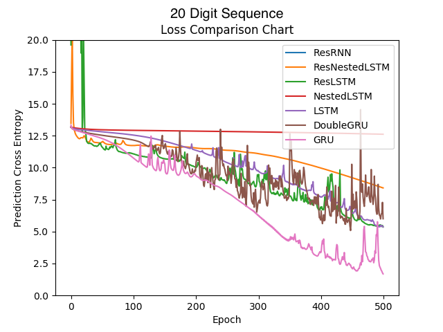

# RNN Modules

### Overview
This is a collection of RNN classes built as PyTorch Modules.

The collection includes the following architectures:

* GRU
* DoubleGRU
* LSTM
* [Nested LSTM](https://arxiv.org/abs/1801.10308)
* Residual GRU
* [Residual LSTM](https://arxiv.org/abs/1701.03360)
* Residual Nested LSTM
* [Residual RNN](https://arxiv.org/abs/1611.01457)

Each has been evaluated on a simple memorization task. The goal was to predict the next binary digit in a random sequence given the k digits prior.

###### Where the x values are a individual binary digits in the sequence and yhat is the RNN's prediction of the next binary digit (for the input of xt, the prediction is of xt+1).

### Result Figures

